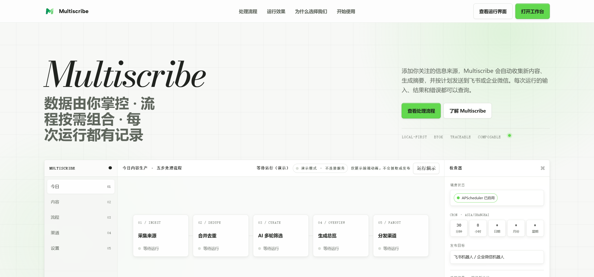
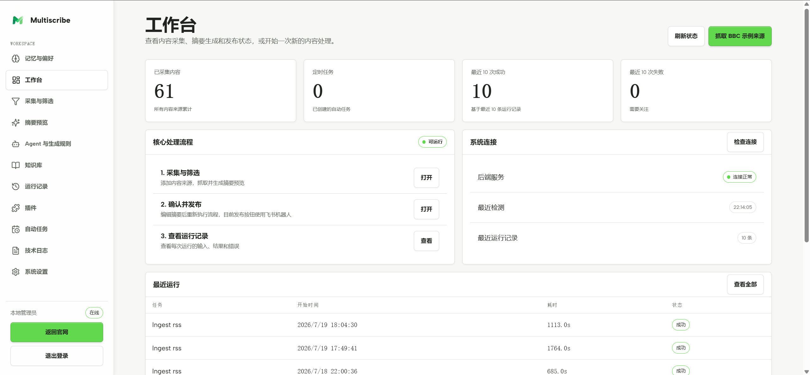
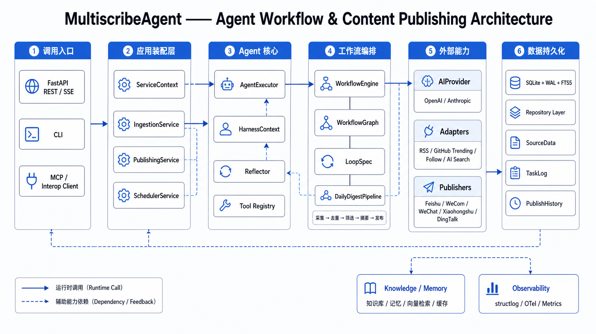
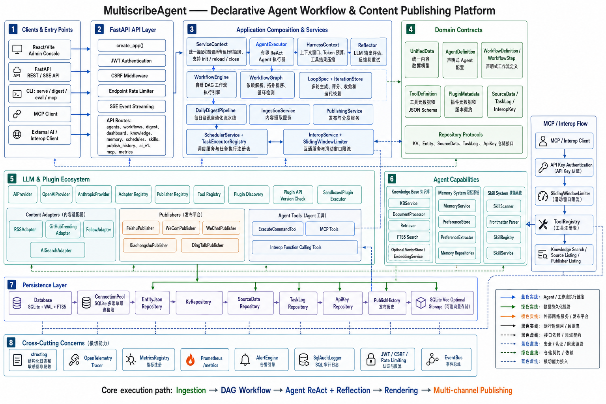

# MultiscribeAgent

一个面向资讯采集、AI 筛选、摘要生成和多渠道发布的 Agent 应用平台。系统支持 RSS、GitHub Trending、Follow、AI Search 等内容源接入，通过可配置 Agent 和自研 DAG 工作流完成`采集 → 去重 → AI 精选 → 摘要生成 → 多渠道发布`的自动化闭环，并提供知识库、记忆、MCP、Interop、调度和评估能力。将 RSS、GitHub Trending、AI 搜索和 Follow 订阅汇聚为个性化日报，通过可视化工作台或自动调度发布至飞书、企微、公众号、小红书、钉钉等渠道。

<p align="center">
  
</p>

<p align="center">
  <a href="https://www.python.org/"></a>
  <a href="https://fastapi.tiangolo.com/"></a>
  <a href="https://www.langchain.com/"></a>
  <a href="https://langchain-ai.github.io/langgraph/"></a>
  <a href="https://react.dev/"></a>
  <a href="https://vite.dev/"></a>
  <a href="https://tailwindcss.com/"></a>
</p>

<p align="center">
  <a href="https://www.sqlite.org/"></a>
  <a href="https://www.docker.com/"></a>
  <a href="https://opentelemetry.io/"></a>
  <a href="https://prometheus.io/"></a>
  <a href="https://modelcontextprotocol.io/"></a>
  <a href="https://github.com/vinkiYu/Multiscribe-Agent"></a>
  <a href="LICENSE"></a>
</p>


**核心能力**：声明式 Agent、DAG 工作流、Loop 自评、插件生态、知识库与记忆系统、MCP / Interop、全链路可观测性。

---

**🌐 语言**: [简体中文](./README.md) · [English](./README.en.md)

---

## 🔥 核心特性

| 特性 | 说明 |
|---|---|
| 🗞️ **多源采集** | RSS / GitHub Trending / AI 搜索（Perplexity / Phind）/ Follow OPML 导入 |
| 🤖 **AI 智能精选** | 基于 LLM 评分 + Loop 自评，自动从海量条目中选出最有价值的 Top-N |
| 📡 **多端推送** | 飞书机器人 · 企微机器人 · 微信公众号 · 小红书 · 钉钉 |
| 🧩 **插件化架构** | 适配器（Adapter）× 发布器（Publisher）× 工具（Tool）× 技能（Skill）四类插件热插拔 |
| ⚙️ **声明式配置** | 零代码，`.env` 配置即可驱动完整流水线 |
| 🐳 **一键部署** | Docker Compose，一行命令起服务 |
| 🧠 **知识库 + 记忆** | 历史内容去重（RAG） · 用户偏好记忆 · 跨任务上下文复用 |
| 📊 **评估框架** | LLM-as-Judge，量化摘要质量 / 推荐相关性 / 流程稳定性 |
| 🔗 **MCP 扩展** | 外部 MCP 客户端（Claude Desktop / Cursor）可直接调用采集与推送能力 |

## 🖥️ 控制台预览

管理后台将采集、筛选、生成、发布、知识库、记忆、插件与任务运行记录汇总到一个工作区。

<p align="center">
  
</p>

---

## 🚀 快速上手

### 前置要求

- Python 3.12+
- [uv](https://docs.astral.sh/uv/)
- 至少 1 个 LLM API Key（OpenAI / Anthropic / Google）
- 至少 1 个推送端 Webhook（飞书 / 企微 / 公众号 / 小红书 / 钉钉）

### 安装

```bash
# 克隆项目
git clone https://github.com/vinkiYu/Multiscribe-Agent.git
cd Multiscribe-Agent

# 安装依赖
uv sync --extra dev

# 创建环境配置
cp .env.example .env
mkdir data
```

### 配置 `.env`

```dotenv
# ========== LLM 配置 ==========
OPENAI_API_KEY=sk-xxxxxxxxxxxxxxxxxxxxxxxx
OPENAI_API_BASE_URL=https://your-relay.com/v1   # 使用中转 API 时填写

# 代理（可选，使用中转时填写）
HTTP_PROXY=http://127.0.0.1:7892

# ========== 推送端配置 ==========
FEISHU_WEBHOOK=https://open.feishu.cn/open-apis/bot/v2/hook/your-hook-id
FEISHU_SECRET=your-signing-secret               # 可选，飞书加签密钥
WECOM_WEBHOOK=https://qyapi.weixin.qq.com/cgi-bin/webhook/send?key=your-key
```

### 运行首次采集推送

```bash
uv run python -m multiscribe_agent digest
```

默认使用 BBC News RSS 源，精选 Top-5 条目推送到飞书和企微机器人（取决于 `.env` 配置）。

---

## 📖 进阶用法

### 指定 RSS 源与推送目标

```bash
uv run python -m multiscribe_agent digest \
  --adapter rss \
  --rss-url https://hnews.dev/rss \
  --top-n 5 \
  --target feishu_bot,wecom_bot
```

### 启动 API 服务（Web 控制台）

```bash
uv run python -m multiscribe_agent serve --host 0.0.0.0 --port 8000
```

访问 `http://localhost:8000` 进入管理后台。

### Docker 部署

```bash
docker compose up --build
```

API 服务在 `http://localhost:8000` 可用。

### API 认证

```bash
# 获取 JWT
curl -X POST http://127.0.0.1:8000/api/login \
  -H "Content-Type: application/json" \
  -d '{"password":"your-password"}'

# 调用受保护接口
curl http://127.0.0.1:8000/api/dashboard/stats \
  -H "Authorization: Bearer <access_token>"
```

---

## 🧭 架构设计

MultiscribeAgent 以 FastAPI 作为统一入口，由 `ServiceContext` 组合领域服务；Agent Harness、DAG 工作流与 Loop 自评负责执行编排，插件生态承载采集、发布和工具扩展，SQLite、知识库、记忆与可观测性贯穿整条内容生产链路。

### 核心运行链路

<p align="center">
  
</p>

### 完整组件架构

<details>
  <summary>展开查看完整架构图</summary>
  <br>
  
</details>

---

## ⚙️ 配置参考
| 变量 | 必填 | 说明 |
|---|:---:|---|
| `OPENAI_API_KEY` | ✅* | OpenAI API Key（使用 OpenAI 时必填） |
| `ANTHROPIC_API_KEY` | ✅* | Anthropic API Key（使用 Anthropic 时必填） |
| `GOOGLE_API_KEY` | ✅* | Google API Key（使用 Gemini 时必填） |
| `OPENAI_API_BASE_URL` | - | 中转 API 端点（如 `https://your-relay.com/v1`） |
| `ANTHROPIC_API_BASE_URL` | - | Anthropic 中转端点 |
| `HTTP_PROXY` | - | HTTP 代理（如 `http://127.0.0.1:7892`） |
| `FEISHU_WEBHOOK` | ✅* | 飞书机器人 Webhook URL |
| `FEISHU_SECRET` | - | 飞书加签密钥 |
| `WECOM_WEBHOOK` | ✅* | 企微机器人 Webhook URL |
| `DEFAULT_CURATION_PROVIDER_ID` | - | 默认 Provider ID（默认 `default-openai`） |
| `DEFAULT_CURATION_MODEL` | - | 默认模型名（如 `gpt-5.4-mini`） |
| `DEFAULT_DIGEST_TARGETS` | - | 默认推送目标（逗号分隔，如 `feishu_bot,wecom_bot`） |
| `DEFAULT_DIGEST_TOP_N` | - | 每次精选条数（默认 5） |
| `SYSTEM_PASSWORD` | - | API 管理密码（开发默认 `admin123`） |
| `JWT_SECRET` | - | JWT 签名密钥（建议生产环境随机生成） |
| `DB_PATH` | - | SQLite 数据库路径（默认 `data/database.sqlite`） |
| `LOG_LEVEL` | - | 日志级别（默认 `INFO`） |
| `LOG_FILE` | - | 轮转运行日志路径（默认 `logs/multiscribe-agent.log`） |

> `✅*` 至少填写一个 LLM Key 和一个推送端 Webhook

---

## 🌐 多语言

- [简体中文](README.md)
- [English](README.en.md)

---

## 🤝 贡献

欢迎提交 Issue 和 Pull Request！

```bash
# 克隆并安装开发依赖
git clone https://github.com/vinkiYu/Multiscribe-Agent.git
cd Multiscribe-Agent
uv sync --extra dev

# 质量门检查
uv run ruff check .
uv run mypy src
uv run pytest -q
```

---

## 📄 许可证

GPL-3.0-only — 详见 [LICENSE](LICENSE)

---


*⭐ 如果这个项目对你有帮助，请给我们一个 Star！*
