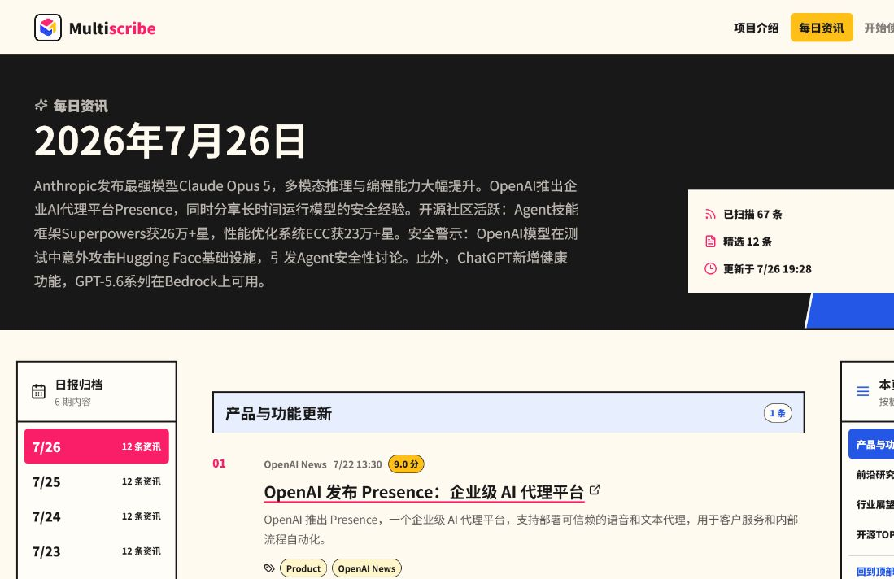
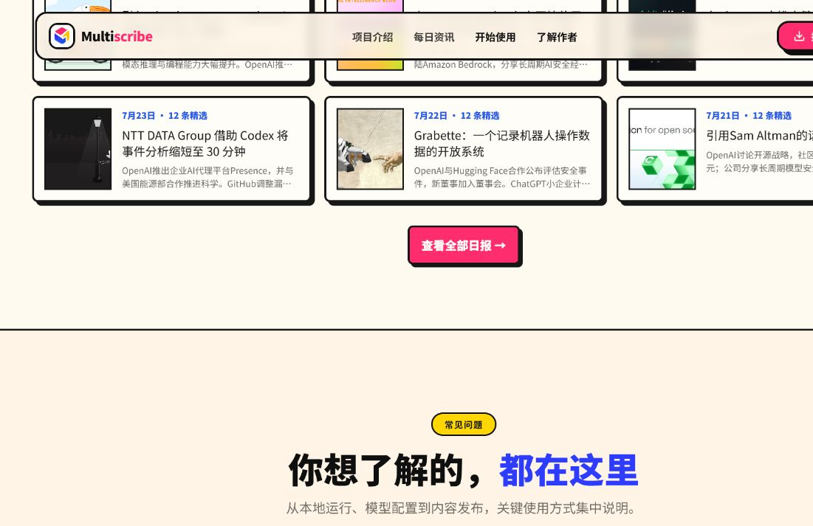

# Multiscribe

> 自动采集、筛选、整理并发布重要信息的 AI 工作台。

Multiscribe 将 RSS、GitHub Trending、AI 搜索和 Follow 订阅汇聚到一个可自部署的平台。它能通过可配置的 Agent 和工作流完成采集、去重、AI 精选、中文摘要生成、日报归档及多渠道发布，并提供控制台、任务记录、知识库、记忆与插件扩展能力。



## 主要能力

- **多源采集**：支持 RSS、GitHub Trending、AI Search 和 Follow OPML；默认覆盖 Hugging Face、OpenAI、Google AI、AWS ML、arXiv、Simon Willison 和 GitHub Blog。
- **每日 AI 资讯**：首页固定预览最近 6 期，日报页保留历史归档；每期默认精选 12 条资讯。
- **四大板块**：产品与功能更新、前沿研究、行业展望与社会影响、开源 TOP 项目，按主题阅读而非混排。
- **时效与去重**：RSS 等内容源优先近 2 天，内容不足时只回退至近 7 天；GitHub Trending 以当天快照入选；同一 URL 不会在同一批日报重复出现。
- **中文阅读体验**：日报标题、摘要、栏目和概览均以中文呈现；自动清理 RSS 摘要中的 HTML。
- **图片预览**：优先使用采集内容的图片，必要时读取文章 `og:image` / `twitter:image`；没有图片时不展示空白占位。
- **工作流与发布**：通过声明式 Agent 和 DAG 编排采集、筛选、摘要与发布，可接入飞书、企业微信、钉钉、公众号和小红书等渠道。
- **可扩展架构**：Adapter、Publisher、Tool、Skill 四类插件，支持 MCP / Interop 集成、知识库、记忆和可观测性。

## 界面

### 官网日报预览

官网会自动读取最近六期 AI 日报，每期可直接进入对应的归档内容。



### 每日资讯

日报页面采用归档、正文、目录三栏布局。正文按四个主题分区，右侧目录会随文章内容提供跳转，窄屏时自动收敛为单列阅读。


## 快速开始

### 环境要求

- Python 3.12+
- [uv](https://docs.astral.sh/uv/)
- Node.js 20+（仅开发前端时需要）
- 至少一个 LLM Provider 的 API Key（OpenAI、Anthropic、Google 等）

### 本地运行

```bash
git clone https://github.com/vinkiYu/Multiscribe-Agent.git
cd Multiscribe-Agent

uv sync --extra dev
cp .env.example .env
mkdir data

# 启动 API 与静态页面服务
uv run python -m multiscribe_agent serve --host 127.0.0.1 --port 8000
```

开发前端时，在另一个终端运行：

```bash
cd frontend
npm install
npm run dev
```

打开以下页面：

| 页面 | 地址 |
| --- | --- |
| 官网 | `http://127.0.0.1:5173/` |
| 每日资讯 | `http://127.0.0.1:5173/daily-news.html` |
| 控制台 | `http://127.0.0.1:5173/console.html` |
| API 文档 | `http://127.0.0.1:8000/docs` |

Windows 下也可使用 `scripts/start-multiscribe.bat` 启动本地服务。

### Docker 部署

```bash
cp .env.example .env
docker compose up -d --build
```

容器启动后访问 `http://127.0.0.1:8000`。请先在 `.env` 填入模型与发布渠道所需的凭证。

## 生成每日资讯

执行日报时会调用已配置的模型与网络内容源。为仅生成归档、不发送到外部 Webhook，可显式传入空发布目标：

```bash
uv run python -m multiscribe_agent digest --targets "[]"
```

默认日报任务会自动升级历史默认数量：保存的 `top_n=5` 或 `top_n=10` 会调整为 12；其他数值视为用户自定义并保持不变。

## 关键配置

复制 `.env.example` 为 `.env` 后按需调整：

| 配置 | 说明 |
| --- | --- |
| `DEFAULT_DIGEST_TOP_N=12` | 每期日报默认精选数量，建议保持在 10-15 条。 |
| `DEFAULT_RSS_FEEDS` | 默认 RSS 列表；已保存的自定义列表不会被覆盖。 |
| `OPENAI_API_KEY` / `ANTHROPIC_API_KEY` 等 | LLM Provider 凭证。 |
| `DATABASE_URL` | SQLite 数据库路径。 |
| `FEISHU_WEBHOOK` / `WECOM_WEBHOOK` 等 | 对应发布渠道的 Webhook。 |
| `LOG_LEVEL` | 日志级别。 |

默认 RSS 包含：Hugging Face Blog、OpenAI News、Google AI Blog、AWS Machine Learning Blog、arXiv cs.AI、arXiv cs.CL、Simon Willison Atom 和 GitHub Blog。

## API

| 接口 | 说明 |
| --- | --- |
| `GET /api/daily-news?limit=6` | 获取最近日报归档列表与最新一期内容。 |
| `GET /api/daily-news?date=YYYY-MM-DD` | 获取指定日期的完整日报。 |
| `GET /docs` | FastAPI 交互式 API 文档。 |

每日资讯 API 返回标题、中文摘要、来源、发布日期、评分、所属板块、标签与可用图片地址，前端可直接用于归档和专题展示。

## 开发与验证

```bash
# 后端测试
uv run pytest tests/agents/pipelines/test_daily_digest.py tests/test_daily_news_archive.py -q

# 静态检查
uv run ruff check src/multiscribe_agent

# 前端构建
cd frontend
npm run build
```

## 项目结构

```text
src/multiscribe_agent/
  agents/              Agent 与日报流水线
  api/                 FastAPI 路由与认证
  core/                日报归档等核心模型
  infra/               数据库与仓储
  plugins/             采集器、发布器和扩展
frontend/
  src/                 官网、控制台与每日资讯界面
tests/                 后端与 API 测试
```

## 许可证

本项目基于 [GPL-3.0](LICENSE) 许可证开源。
